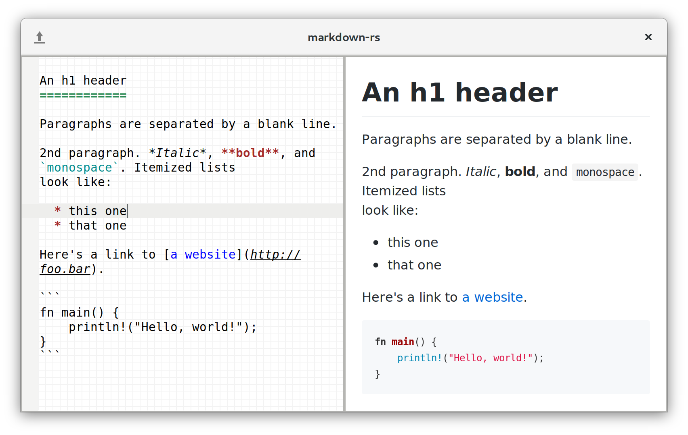

# Markdown Rust
Fast, simple, distraction free Markdown editor.

## Motivation
There seem to be no simple, fast Markdown editors on Linux. Most of them are built with some version of Chrome and Javascript.

This project is inspired by [uberwriter](http://uberwriter.wolfvollprecht.de/).

## Tools required
 - GTK UI: http://gtk-rs.org/
 - GtkSourceView multiline text editing: https://github.com/gtk-rs/sourceview
 - Markdown parser/renderer: https://github.com/kivikakk/comrak
 - WebKitGtk HTML preview: https://github.com/gtk-rs/webkit2gtk-rs

## Development

Build:

    cargo build

Run:

    ./target/debug/markdown-rs

Test:

    cargo test -- --test-threads=1
